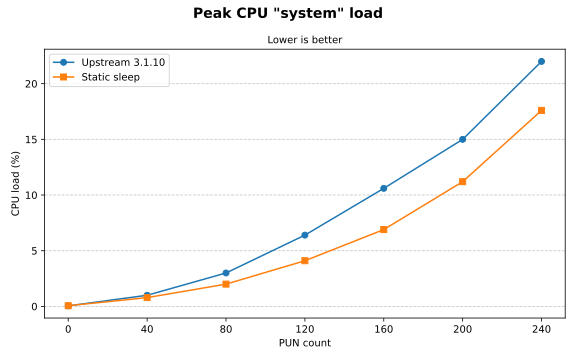
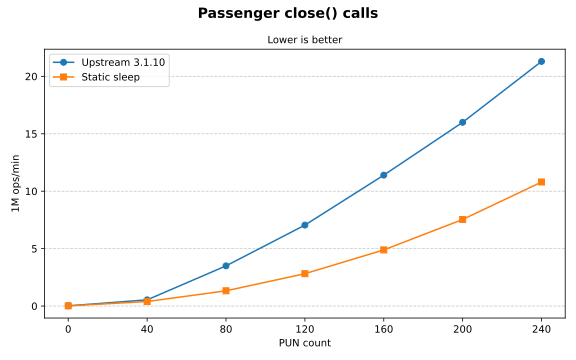
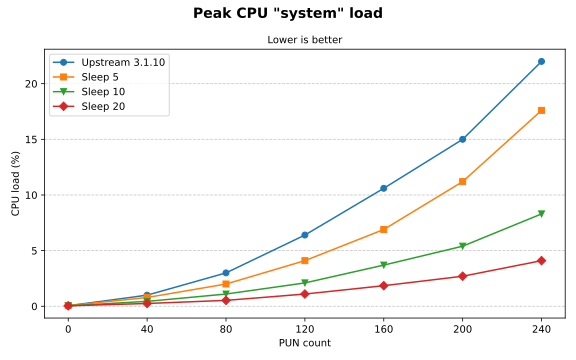
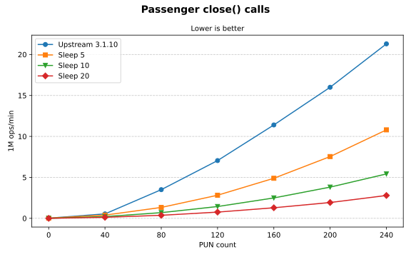
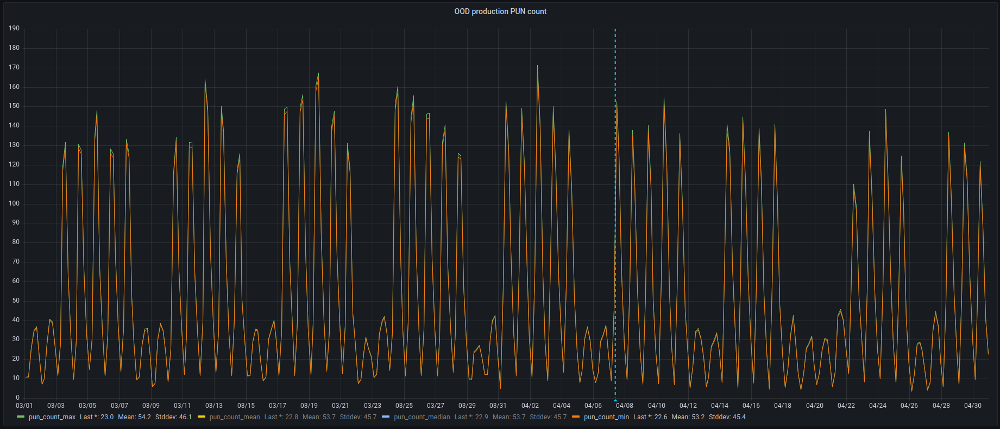
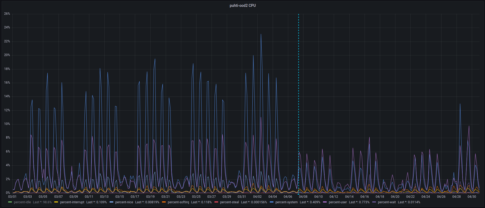

# Scaling up OOD – A sysadmin's perspective

## Abstract

CSC – IT Center for Science has used Open OnDemand for a few years, and it
has grown in popularity among our users. So much so, that we started seeing
performance issues and slowness on our busiest supercomputer's web interface.

In this paper we explore a few examples of how we found and mitigated performance
issues with our Open OnDemand instance. Some of the issues were site specific, while
some were inherent to Open OnDemand's architecture and dependencies.

We show patches and benchmark results, as well as snapshots of production load
prior to, and after the optimizations were put in place.


## Introduction

Open OnDemand [@Hudak2018] is a web-based client portal for high-performance computing
(HPC) centers which allows HPC users to access supercomputing resources via their web browsers.
Open OnDemand (OOD) provides users with an alternative interface to the traditional
SSH terminal, which makes it popular for example among beginner HPC users.

At CSC – IT Center for Science [@cscfi] we have been using OOD on our Puhti supercomputer
since September 2021, and the Mahti and LUMI supercomputers followed in May 2023, and November 2023
respectively. Especially the Puhti supercomputer's web interface has grown increasingly popular over
the years, with up to 1500 unique users logging into the web interface each month, and up to 700
unique users submitting at least one Slurm job each month. In a single day, the number of concurrent
users logged into the web interface could reach up to 250.

This high number of concurrent users on the single OOD instance started revealing issues with performance
in the summer of 2024. The system load on the OOD server was very high at times, and users reported
slowness from time to time. We looked into the issues and found a few important things to optimize,
as well as an architectural issue, which we submitted fixes for upstream for the rest of the OOD
community to benefit from.

## Performance issues

When we realized that there were scalability issues, we started investigating the
reasons for them. Below we will describe how what we observed on our system, and
how we analyzed the issues.

### The OOD deployment

Let us start with a short description of our OOD deployment, to set the performance
numbers that will be presented later into context.
At the time, we were using OOD version `3.1.x`.
OOD was installed into a Podman container with a Rocky Linux 8 base image.
The server we ran the OOD container on was a virtual machine (VM) with 12 vCPUs and 50 GiB of RAM.
The hypervisor was based on the Intel Cascade Lake platform.

### High load averages

The first indications that something was wrong was high system load reported by the Linux server
running the OOD server. We could see system load numbers of up to 500, which was certainly not normal.
The output of `top` while we were observing high system load showed 7% user load, 44% system load and 45% nice load.
The nice load was represented by `ps` and `PassengerAgent` processes of various users.
We could observe that `ps` processes were short-lived, and that they returned at a five-second interval.

Upon further analysis, using the `perf` tool, we could see that the amount of `close()` system calls
were above 1 million for a chosen user's Passenger process in a single five-second interval.
This was certainly one source of the elevated system CPU load.
This load scaled linearly after a certain threshold, which explains why we did not experience any
issues with fewer concurrent users.
We observed a bit over 55 million `close()` system calls for 90 concurrent users
every five seconds. We used the command in [the following code listing](#code_perf_syscalls) to observe a single cycle's system call counts.

:::{code} bash
:label: code_perf_syscalls
perf stat -e 'syscalls:sys_enter_*' -a sleep 5
:::

`perf` also helped us identify what processes get most frequently executed.
To gather this data, we used:

```bash
perf record -e 'sched:sched_process_exec'
# Wait for a while to gather enough samples, then interrupt
^C

# Generate a report based on the recorded data
perf report
```

Based on a sample size of 7137 exec calls, our report showed that `ps` represented 18% of the executed processes.
This was in line with what we described above.
However, we also observed that `sh`, `id`, `getent`, and `user-mapper.sh` were represented by 17% each,
bringing the total share of execs by these processes to 68%. The latter group of process names we could
recognize from our user mapper implementation.

### User mapper

The so-called user mapper [@OscUserMapping] in OOD is a Lua hook in Apache httpd, which
administrators can choose to call in order to map (translate) usernames from one format
to another between what httpd is told by the authentication framework and what
the Linux system will recognize. The user mapper receives one string as input, which
contains the username that httpd has received after user authentication.
A common example would be that the authentication framework reports a username of `alice@example.com`, but
the Linux system only recognizes the `alice` username. In this situation, the user mapper program could
be written to remove `@example.com` from each input string.

At CSC we have chosen to implement a few extra checks inside the user mapper. Our user mapper was implemented
as a shell script, which would check whether the given username existed on the system, and if it did, check
whether the user ID (UID) was greater than, or equal to 1000. This would prevent situations where a system
username (`UID < 1000`) is allowed to log into OOD.

:::{code} bash
:label: code_user_mapper_inefficiency
# ...
if getent passwd "${INPUT_USER}" > /dev/null 2>&1 ; then
  INPUT_USER_UID="$(id -u "${INPUT_USER}")"
  # ...
:::

The user mapper was poorly implemented, and for example did not reuse the output of `getent` to check the UID
after verifying that the user existed on the system, as seen in the [code listing above](#code_user_mapper_inefficiency).
Furthermore, since the user mapper gets executed on every HTTP request that proxies to a per-user nginx
(PUN) instance, the choice of a shell script was not the most optimal and performant option.
The impact of this inefficiency was high.
Our metrics showed that the average number of requests per second could reach up to 50
during busy hours.


## Root cause analysis

While the user mapper issue is easy to understand, the reason for the high system
load is not as easy to find based on the observations above.
After we identified the above system load issues, we started looking for the correct ways
to mitigate them. This involved looking into the Phusion Passenger [@PhusionPassenger]
source code and understanding how our specific system configurations affected the
performance of Passenger and OOD.

Passenger is an integral component in OOD. It is the middleware responsible for receiving
HTTP requests in the PUNs, and forwarding them to the appropriate application code.
In OOD's case, this is usually a Ruby-on-Rails application, or in the Shell app's case,
a NodeJS application. It can also be any site-specific Ruby, NodeJS, or Python application.

When reviewing the source code of Passenger, we noticed that the reason for the high amount
of `close()` system calls was Passenger's analytics collection, which gathers CPU and memory
metrics for each of the running Passenger apps.
The Passenger analytics collection is, as far as we can see, only for collecting operational
metrics and statistics. The collected data does not feed back into Passenger's operations
automatically in any way.
Passenger is architecturally made for being vertically scalable, i.e., being able to
increase or decrease the amount of worker processes depending on the amount of requests.
This feature of Passenger is arguably not necessary for basic OOD usage, as each user has
their own, private web server instance (the PUN). This specific architecture choice by
OOD conflicts with Passenger's assumption of how the middleware is being deployed.

The Passenger analytics collection has been programmed to always happen every five seconds,
such that it triggers as close to the wall clock times divisible by 5 as possible, e.g.,
11:00:00, 11:00:05, 11:00:10, and so on. This implementation is understandable for a monolithic
Passenger deployment, where a stable 12 samples per minute is desirable. The code [@PassengerAnalyticsTiming]
looks like this:

```cpp
unsigned long long currentTime = SystemTime::getUsec();
unsigned long long sleepTime = timeToNextMultipleULL(5000000, currentTime);
P_DEBUG("Analytics collection done; next analytics collection in " <<
    std::fixed << std::setprecision(3) << (sleepTime / 1000000.0) <<
    " sec");
```

However, for a deployment such as OOD's this ends up magnifying the amount of work to be done
by the server. Especially the fact that all of the Passenger analytics processes get created
at almost the exact same time creates a lot of load on the Linux system which has to schedule all
of the forks and `ps` executions at essentially the same time.

When the analytics collection happens, Passenger would fork a separate process for calling `ps` [@PassengerPsCall],
which in itself is not an issue. The issue, in our case came from the fact that when forking a Linux process,
all of the opened file descriptors will be cloned into the new (forked) process. It is good practice to close
the file descriptors that are not supposed to be used by the child process. Due to all the forking
happening at once, most of the child processes could not find their highest open file descriptor
quickly enough, and ended up timing out and resorting to the fallback option of the highest allowed
(hard) limit of open files on the system, i.e., `ulimit -Hn`.
Passenger would first try parsing the `/proc/self/fd` directory (in the Linux implementation of Passenger),
but if this does not return a result within 30 ms, the fallback is used.
[@PassengerHighestFdTimeout] [@PassengerHighestFdFallback]

The choice to run OOD inside of a Podman container causes a slight overhead when it comes to
running `ps` for example. When a process accesses the `/proc` file system,
the Linux kernel will need to filter away all processes which are not
supposed to be visible to the container, which naturally causes a bit of overhead.
This overhead has been measured to have an impact of around 40 µs per 1000 process
entries on the system [@GreggSystemsPerformance, pg. 553].
At the time of writing, the cited numbers are 12 years old, but it provides an
estimate for an upper bound if we can assume that the Linux kernel hasn't regressed
on this particular benchmark. CPUs are thankfully also faster nowadays.

Let us consider an example with 250 concurrent users, which all call `ps` once every 5 seconds.
If the system which runs the containerized OOD has a grand total of 5000 processes, the overhead
of the containerization would be:

```
# Calculate the share of the overhead time in a 5-second cycle:
((40 µs / 1000 processes) * 5000 processes * 250 users) / 5 s
# Convert µs to s
((4e-5 s / 1000 processes) * 5000 processes * 250 users) / 5 s
# Result:
0.05 s / 5 s == 0.01 == 1%
```

This example shows us that containerization with OOD can have a measurable overhead
with high amounts of users. With fewer concurrent users, the overhead shrinks quickly.
We acknowledge the existence of this overhead in our Podman-based deployment, but
claim that it has not been a significant reason for our performance issues this far.


## Implemented optimizations

### User mapper rewrite

The user mapper shell script had some issues which were trivial to fix, like reusing
the output of the previous `getent passwd ${INPUT_USER}` command, instead of
calling `id -u ${INPUT_USER}` in order to find the UID. However, the execution time
of a shell script is bound to be higher than that of a compiled binary executable.
Therefore, we decided to rewrite the user mapper program with the C programming language.

During the rewrite, also additional sanity checks were added, such as preventing the use
of the "nobody" username. We also learned that logging to standard error makes the messages
appear in the httpd error logs, which was useful for error situations.


### Lowered limit of opened files

On our OOD server, the limit was set to one million, which corresponds to our observations above.
The reason for this decision was that Slurm's `sbatch` tool will inherit the `ulimit` values by default.
We had previously had a smaller limit, but certain interactive applications, like RStudio likes to have a
high amount of files open.

Fortunately, `sbatch` can be told to not inherit the limits from the submission host, and adopt the
compute node's limits instead. This was easily implemented by adding `--propagate=NONE` to all `sbatch`
calls in our OOD interactive applications. After this, we could lower the limit to something more reasonable,
like 4096. Thankfully, we did not have any Passenger applications requiring a large number of open files
on our OOD web server.


### Passenger analytics collection patch

In order to solve the timing issue of Passenger's analytics collection, we were forced to patch the
Passenger source code. Since Passenger is under the MIT license [@PassengerLicense], we have the possibility
to patch it and distribute the changes via OOD. We wanted to do two things. Firstly, remove the enforced
same time execution for each Passenger instance in favor of a static sleep time.
Secondly, make the interval configurable via an environment variable, so that OOD administrators can choose
their own sleep interval, in case the Passenger metrics actually are being collected and used.
We also wanted to take care and enable the community to revert to upstream Passenger behavior, in case someone
had a use case which required it.

:::{code} diff
:label: code_passenger_patch
--- a/src/agent/Core/ApplicationPool/Pool/AnalyticsCollection.cpp    2025-04-08 11:10:06.588386188 +0300
+++ b/src/agent/Core/ApplicationPool/Pool/AnalyticsCollection.cpp    2025-05-06 10:24:26.992332131 +0300
@@ -23,8 +23,17 @@
  *  OUT OF OR IN CONNECTION WITH THE SOFTWARE OR THE USE OR OTHER DEALINGS IN
  *  THE SOFTWARE.
  */
+#include <cstdlib> // getenv
+#include <climits> // INT_MAX
+
 #include <Core/ApplicationPool/Pool.h>

+// OOD override: Validate assumptions about type sizes, to be sure that
+// multiplications don't overflow.
+// static_assert() requires a minimum language standard of C++11.
+static_assert(sizeof(int) == 4, "Size of int is not 4 bytes!");
+static_assert(sizeof(unsigned long long) == 8, "Size of unsigned long long is not 8 bytes!");
+
 /*************************************************************************
  *
  * Analytics collection functions for ApplicationPool2::Pool
@@ -62,8 +71,51 @@
		}

		UPDATE_TRACE_POINT();
-		unsigned long long currentTime = SystemTime::getUsec();
-		unsigned long long sleepTime = timeToNextMultipleULL(5000000, currentTime);
+
+		// Open OnDemand override: Change the default sleeping behavior unless the following environment
+		// variable is defined: OOD_OVERRIDE_PASSENGER_ANALYTICS_COLLECTION_RESTORE_UPSTREAM_BEHAVIOR.
+		// Use a static sleep of 30 seconds by default.
+		// This can be overridden with the OOD_OVERRIDE_PASSENGER_ANALYTICS_COLLECTION_SLEEP_TIME_SECONDS variable.
+		// NOTE: Setting this to a very big value will impact the usefulness of passenger-status metrics,
+		//       which will not get gathered unless this loop runs. If you do not care about the metrics,
+		//       feel free to set very large values.
+		const unsigned long long defaultSleepTime = 30ULL * 1000000ULL; // microseconds
+		unsigned long long sleepTime = defaultSleepTime;
+		const char* envPassengerRestoreUpstreamBehavior = std::getenv("OOD_OVERRIDE_PASSENGER_ANALYTICS_COLLECTION_RESTORE_UPSTREAM_BEHAVIOR");
+		if (envPassengerRestoreUpstreamBehavior) {
+			// Upstream Passenger behavior
+			unsigned long long currentTime = SystemTime::getUsec();
+			sleepTime = timeToNextMultipleULL(5000000, currentTime);
+		} else {
+			// Open OnDemand override: Use a static OOD_OVERRIDE_PASSENGER_ANALYTICS_COLLECTION_SLEEP_TIME seconds sleep time
+			// Try reading from the environment variable. If this is undefined, or invalid, use the defaultSleepTime instead.
+			const char* envPassengerSleepTimeOverride = std::getenv("OOD_OVERRIDE_PASSENGER_ANALYTICS_COLLECTION_SLEEP_TIME_SECONDS");
+			int sleepTimeOverride = INT_MAX; // initial value (use a smaller type to allow safe multiplication to ULL)
+			do {
+				if (envPassengerSleepTimeOverride) {
+					// Convert to an ull and check for errors. Use the default in case of errors.
+					try {
+						sleepTimeOverride = std::stoi(envPassengerSleepTimeOverride);
+					} catch (const std::exception& e) {
+						// std::invalid_argument or std::out_of_range, stop here.
+						// Print loud warnings, since this is a misconfiguration by the site admin.
+						P_WARN("ERROR: Could not parse OOD_OVERRIDE_PASSENGER_ANALYTICS_COLLECTION_SLEEP_TIME_SECONDS value '"
+								<< envPassengerSleepTimeOverride << "' as an int. Using default "
+								<< defaultSleepTime << " microseconds instead.\n"
+								<< "  Reason: " << e.what() << "\n");
+						break;
+					}
+					// If we got here, there was a valid int. Sanity check that it's > 0.
+					if (sleepTimeOverride != INT_MAX && sleepTimeOverride > 0) {
+						// Use this value. Multiply by 1M microseconds.
+						sleepTime = (unsigned long long)sleepTimeOverride * 1000000ULL;
+					}
+					// Otherwise, keep the default value.
+				}
+			} while (false);
+		}
+
+
		P_DEBUG("Analytics collection done; next analytics collection in " <<
			std::fixed << std::setprecision(3) << (sleepTime / 1000000.0) <<
			" sec");
:::

The [above patch](#code_passenger_patch) for the C++ code was added to the
`ondemand-packaging` repository after the GOOD 2025 conference [@OodPackagingPr],
and has been available for the benefit of the community since
`ondemand` versions `3.1.12` and `4.0.4`. [@OodRelease3112] [@OodRelease404]


## Results

In order to verify the effectiveness of the optimizations, we executed some basic benchmarks.
In the following sections, we'll break down the different benchmarking methodologies and the
results of those benchmarks for the user mapper changes, the open files limit change,
as well as the Passenger patches.


### User mapper benchmarks

In order to benchmark the user mapper, we focused on running a so-called "happy" case
and analyzing its performance characteristics. We trust the authentication framework to
generally give us a correct user name, and this is the code path which will be executed the
most in production.

So we took the old shell script, and the new C program (compiled with the `-O2` optimization level),
put them on the same OOD host inside the supercomputer, so that the available user accounts were
the same as in production. Then we executed the following `perf` command with a valid username
as input, to sample 20 executions:

```bash
perf stat -r 20 --table ./old-user-mapper.sh "${valid_username}"

perf stat -r 20 --table ./new-user-mapper "${valid_username}"
```

Some key metrics and their comparison are presented in @tbl:user_mapper_results.

:::{list-table} User mapper benchmark results
:label: tbl:user_mapper_results
:align: center

* -  
  - Shell script
  - C program (`-O2`)
  - Diff
* - Execution time
  - 6.614 ms
  - 1.679 ms
  - -72.8%
* - N/o instructions
  - 8,985,413
  - 1,258,279
  - -86.0%
* - N/o branches
  - 2,136,927
  - 352,919
  - -83.5%
:::

This result was a clear improvement, and visibly decreased the load on the system while
it was in active use by many concurrent users. Our load averages dropped from
around 30-50 down to 1.0-1.5 with a similar amount of users using the web interface.


### Max open files limit

After we lowered the max open files limit from one million to 4096, we performed the same
[perf benchmark](#code_perf_syscalls) as during our analysis to compare how similar user
amounts caused `close()` calls.

:::{list-table} Max open files `close()` changes with 90 PUNs during 5 seconds
:label: tbl:max_open_files_results
:align: center

* - Limit 1,000,000
  - Limit 4,096
  - Diff
  - `(4096 - 1000000) / 1000000`
* - 55M
  - 730k
  - -98.7%
  - -99.6%
:::

In line with our expectations, the 99.6% decrease in the max open files limit decreased
the `close()` calls during a five-second period by 98.7%.


### Passenger benchmarks

When evaluating the Passenger patch, we ran a benchmark which involved letting
`N` PUNs idle with an OOD Dashboard app which is not receiving any requests after
the initial request to `/pun/sys/dashboard` which is required for the app to start.
We then measured CPU load and `close()` syscall counts per 59 seconds on the minute
for around 7 minutes, before launching another 40 PUNs. In our benchmarking, we tested
a range of 40, 80, 120, 160, 200, and 240 PUNs concurrently idling.
The benchmarks were executed inside an OOD Podman container on a VM which matches
the production VM in terms of performance.
See the [script below for the exact code](#code_passenger_benchmark).
All user account which were utilized had completely empty home directories stubbed for
them during the benchmark, to avoid any side effects.

We sampled the metrics values once per minute from when the PUN count was stable at the
given level, and averaged the sampled values. The `nginx_stage nginx_clean` background
job was disabled for the duration of the benchmark, in order to avoid interference.

:::{code} bash
:label: code_passenger_benchmark
:linenos:
#!/bin/bash
for puns in 40 80 120 160 200 240 ; do
  echo "Going up to $puns PUNs starting at $(date +%FT%H%M%S)" &&
  while read username ; do
    echo "-> ${username}" &&
    # Ensure that the test user's stubbed home directory exists (redacted)
    if [ ! -e "/var/run/ondemand-nginx/${username}/passenger.sock" ]; then
      # Start a PUN if one isn't already running
      /opt/ood/nginx_stage/sbin/nginx_stage pun -u "${username}" \
        -P /etc/ood/pun_pre_hook.sh ;
    fi &&
    # Send an HTTP request to the PUN to activate the dashboard app
    curl --unix-socket /var/run/ondemand-nginx/${username}/passenger.sock
        http://localhost/pun/sys/dashboard > /dev/null 2>&1 &&
    echo "OK" ;
  done < <(getent passwd \
      | awk -F: '{if ($3 >= 1000 && $1 != "nobody") print $1; }' \
      | head -n "${puns}") ;
  echo "Reached $puns PUNs at $(date +%FT%H%M%S)" &&
  sleep 420 ;
done ; echo "All done at $(date +%FT%H%M%S)" ;
:::

This benchmark was repeated a number of times, in order to test the impact of
different optimization combinations, and analytics collection intervals:

1. The original, upstream OOD version 3.1.10, which sleeps dynamically to wake up every 5 seconds.
2. A patched Passenger, which sleeps statically for 5 seconds
3. A patched Passenger, which sleeps statically for 10 seconds
4. A patched Passenger, which sleeps statically for 20 seconds

With the data gathered from these benchmarks, we compared the dynamic versus static sleep
(@fig:passenger_static_dynamic_benchmarks), as well as the impact of incrementing the
sleep times (@fig:passenger_sleep_time_benchmarks).

:::{figure}
:label: fig:passenger_static_dynamic_benchmarks
:align: center

(fig_dynamic_static_sleep_cpu)=


(fig_dynamic_static_sleep_close_calls)=


The impact of moving from dynamic sleep intervals to static sleeping was already measurable.
:::

:::{figure}
:label: fig:passenger_sleep_time_benchmarks
:align: center

(fig_sleep_intervals_cpu)=


(fig_sleep_intervals_close_calls)=


A longer sleep interval dramatically decreases the CPU load, especially for higher PUN counts.
:::

As one can determine by the [benchmark script](#code_passenger_benchmark), the staggering
of PUNs was only as long as it took to start one PUN and move on to the next.
It was not for example uniform across the sleep interval.
This was not something we controlled in this benchmark, but we would expect this benchmark
to be a worse scenario than a natural distribution of PUN start times within the site-specific
sleep intervals.


### Production metrics before and after the Passenger optimizations

A comparison of some key performance metrics and load graphs before and after deploying the
passenger optimizations shows how impactful the changes were for the Puhti supercomputer.

:::{figure}
:label: fig_puhti_metrics
:align: center

(fig_puhti_user_count)=


(fig_puhti_cpu_load)=


(fig_puhti_close_calls)=


Puhti system metrics from before and after the Passenger optimization deployment on 2025-04-07.
:::

As the [](#fig_puhti_user_count) shows, the concurrent user count stayed largely on the same level,
which makes the other metrics comparable. The differences before and after the Passenger changes
in [](#fig_puhti_cpu_load) and [](#fig_puhti_close_calls) are so significant that a slight
decrease in user count after the dashed line does not explain it.


## Future work

In order to optimize our user mapper usage further, we could consider
moving into Lua C library integrations, where the Apache httpd server
can load a C library and call its functions, instead of executing a
separate program. This would likely not be too challenging to implement,
given that we already have a standalone C program which can perform the
required sanity checking and error handling.

Another bottle neck of our user mapper is the requirement to make a `getpwnam`
C library call on each execution, so that we can resolve the username into
a `struct passwd` object. If this could be cached centrally by a system daemon
which stays alive as long as needed, this library call would not be needed for
every user mapper execution.

On a more general level, the Open OnDemand project should look out for architectural
pitfalls like the Passenger case. We see a similar issue in how Slurm data is
handled by OOD. Currently (OOD version `3.1.x`) every PUN needs to query Slurm
data via `squeue` and similar client tools, even though the state information
about the Slurm cluster is shareable information for all users on the cluster
(unless Slurm's PrivateData [@SlurmPrivateData] configuration is used).
Data sharing would be especially important if accounting data is to be used,
since `sacct` commands can be very demanding on the Slurm database.

One challenge with the data sharing is how the data would be cached, such that
no single user can poison the caches for everyone else. The data would need
to be written by a trusted system service, and then presented as read-only for
all of the PUNs.


## Conclusion

The scalability of an Open OnDemand installation depends on many things,
some of which are site specific, while the rest is embedded in the OOD architecture
and implementation. Certain mistakes reveal themselves only when the number of
concurrent users reaches a threshold, and then it can require some amount of
detective work and analysis to uncover where the issue stems from.

Open OnDemand seems to be growing in popularity, which hopefully leads to
scalability improvements for the project as community members keep pushing
the user count per instance upwards.
